# 🎯 RedTrack

<p align="center">
  
</p>

[](https://spring.io/projects/spring-boot)
[](https://angular.io/)
[](https://www.mongodb.com/)
[](https://www.docker.com/)
[](https://www.jenkins.io/)

## 📋 Table des Matières

- [À Propos du Projet](#-à-propos-du-projet)
- [Documentation](#-documentation)
- [Technologies Utilisées](#-technologies-utilisées)
- [Prérequis](#-prérequis)
- [Installation](#-installation)
- [Configuration](#-configuration)
- [Utilisation](#-utilisation)
- [Fonctionnalités](#-fonctionnalités)
- [Tests](#-tests)
- [Déploiement](#-déploiement)
- [Contributeurs](#-contributeurs)

## 🎯 À Propos du Projet

RedTrack est une plateforme de suivi des projets Fil Rouge pour YouCode. Elle permet aux formateurs de suivre l'avancement des projets des apprenants de manière centralisée et efficace.

### 🎯 Objectifs Principaux

- Centraliser le suivi des projets Fil Rouge
- Automatiser le processus de validation des étapes
- Faciliter la communication entre formateurs et apprenants
- Fournir des statistiques détaillées sur l'avancement des projets

### 📚 Documentation
- [Cahier des Charges](https://docs.google.com/document/d/1Lsd7hk6Ecl0_b05vtQJuAxI-ZE-Ticaka4HIkiFTmSE/edit?hl=fr&tab=t.0)
- [Maquettes Figma](https://www.figma.com/design/od1gmm8ir8BoUx4Jjy6IvX/RedTrack?node-id=0-1&t=ufRb1ui40k1Zosyb-1)
- [Planification Jira](https://asmaabarj5.atlassian.net/jira/software/projects/RT/boards/430/backlog)

### 📸 Captures d'écran

#### Interface RedTrack
<p align="center">
<h3>Authentification</h3>
  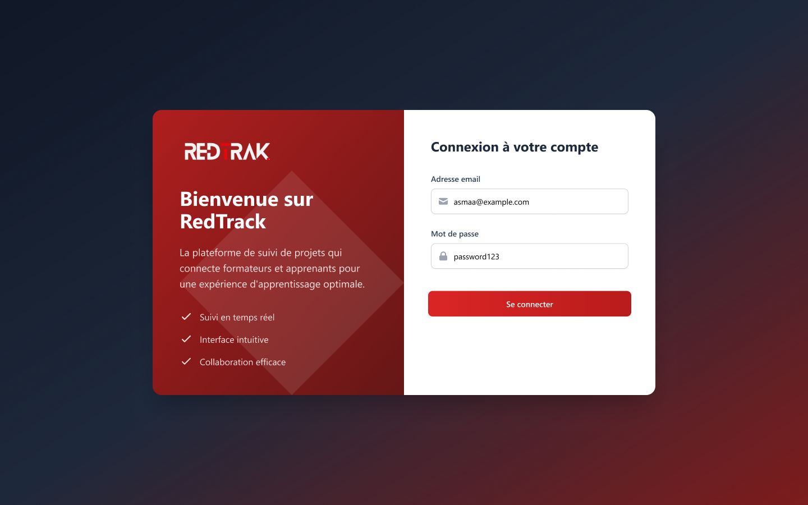
<h3>admin</h3>
  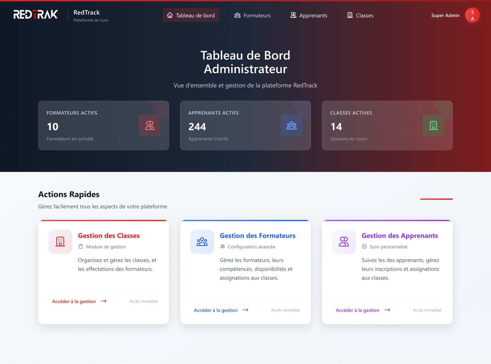
  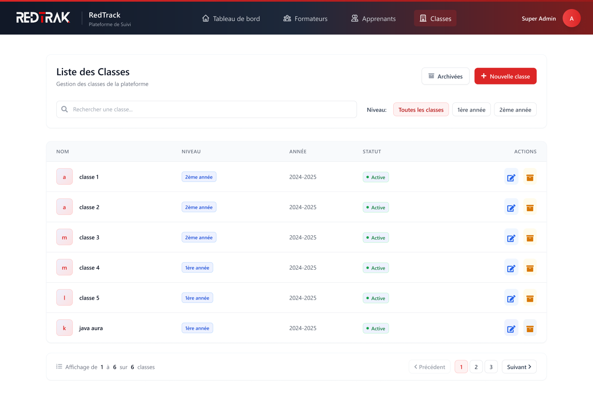
  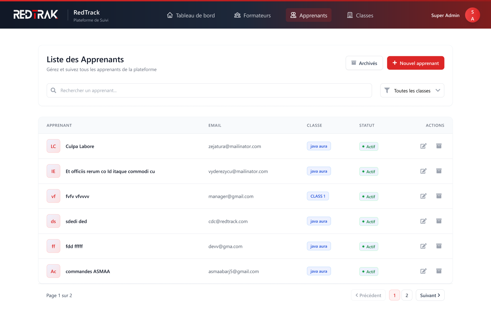

<h3>formateur</h3>
  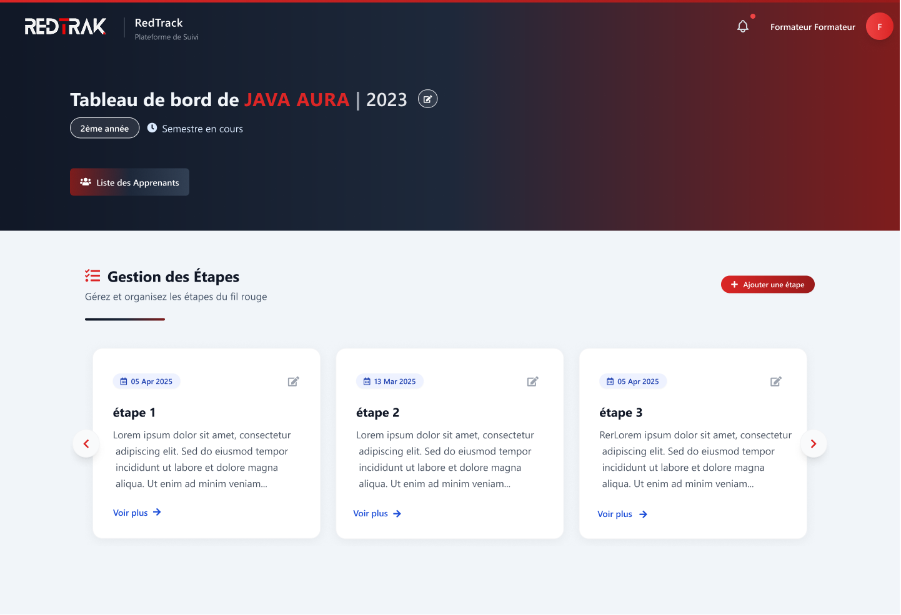
  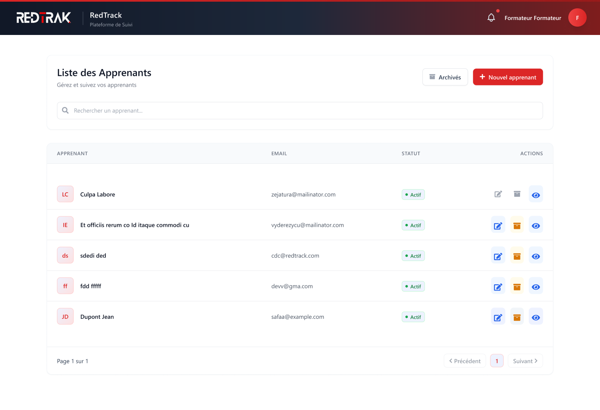
  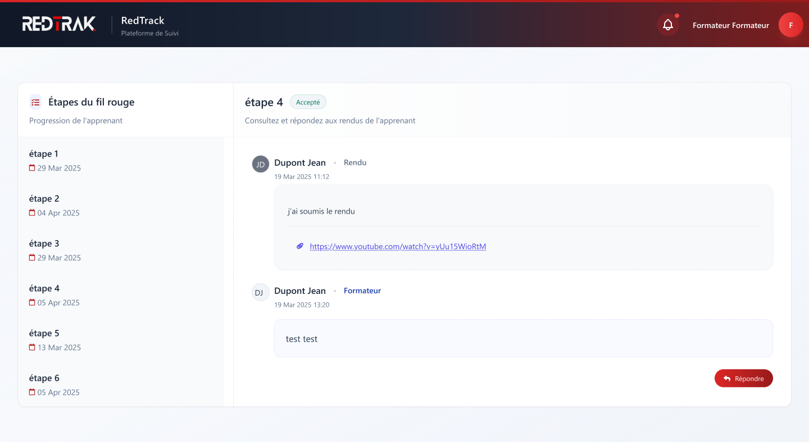

<h3>apprenant</h3>
  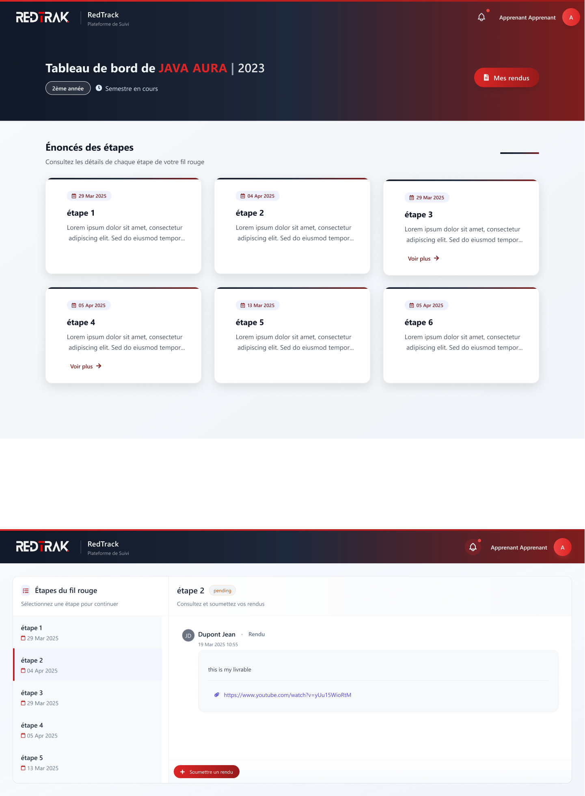
  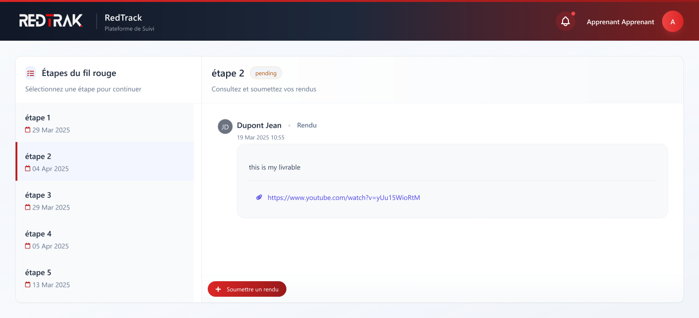
    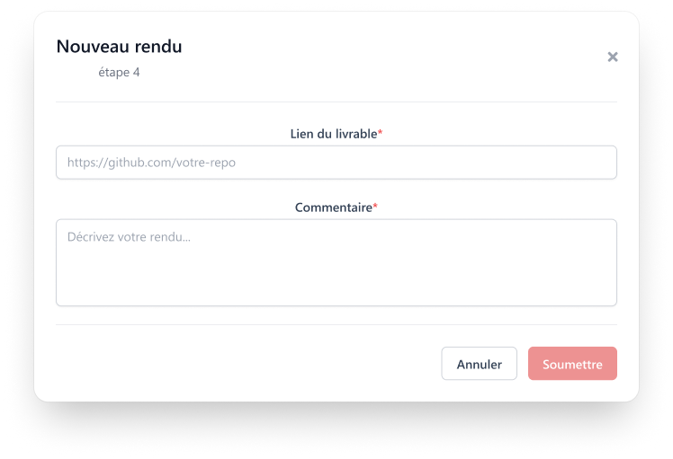

  <!-- Ajoutez d'autres captures d'écran selon vos besoins -->
</p>

### 📊 Diagrammes

#### Diagramme de Cas d'Utilisation
<p align="center">
  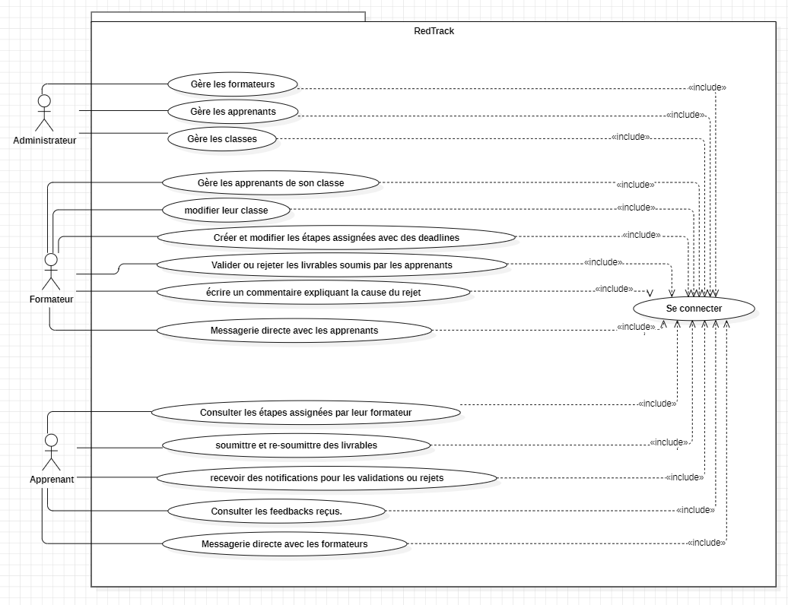
</p>

#### Diagramme de Classes
<p align="center">
  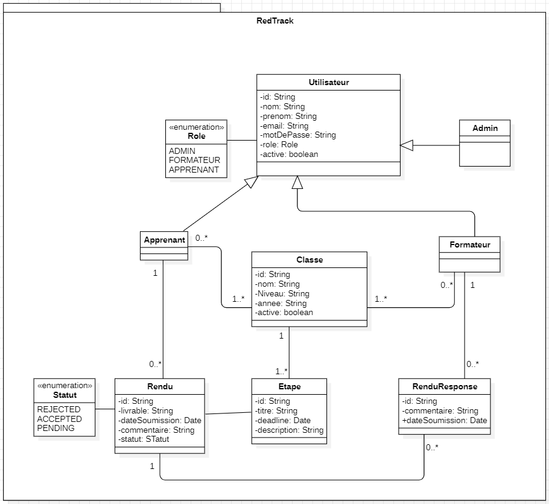
</p>

## 🛠 Technologies Utilisées

### Backend
- ☕ Java 8
- 🍃 Spring Boot 2.7.18
- 🔒 Spring Security
- 🗄️ MongoDB

### Frontend
- 📱 Angular 17
- 🎨 TailwindCSS
- 📦 NgRx pour la gestion d'état

### DevOps
- 🐳 Docker
- 🔄 Jenkins

## 🏗 Architecture du Projet

## 📋 Prérequis

- Java 8 ou supérieur
- Node.js 20.x
- Docker & Docker Compose
- MongoDB
- Jenkins (pour le CI/CD)

## 🚀 Installation

1. **Cloner le repository**

```bash
git clone https://github.com/asmaabarj/RedTrack.git
cd RedTrack
```

2. **Configuration de l'environnement**
```bash
# Backend
cd Back-end
cp .env.example .env
# Modifier les variables d'environnement selon vos besoins

# Frontend
cd Front-end
cp .env.example .env
```

3. **Lancement avec Docker Compose**
```bash
docker-compose up -d
```

## ⚙️ Configuration

### Variables d'Environnement Backend

```properties
# Application
SPRING_PROFILES_ACTIVE=prod
SERVER_PORT=8080

# MongoDB
MONGODB_URI=mongodb://mongodb:27017/redtrack
MONGODB_DATABASE=redtrack

# JWT
JWT_SECRET=votre_secret_jwt
JWT_EXPIRATION=86400000

# Logging
LOGGING_LEVEL_ROOT=INFO
```

### Variables d'Environnement Frontend

```env
API_URL=http://localhost:8080/api
ENVIRONMENT=production
```

## 💻 Utilisation

### Accès aux Applications

- **Frontend**: `http://localhost:80`
- **Backend API**: `http://localhost:8080`
- **Jenkins**: `http://localhost:8085`
- **MongoDB**: `mongodb://localhost:27017`

### Comptes par Défaut

```yaml
Admin:
  Email: admin@redtrack.com
  Password: Admin123!

```

## 🔥 Fonctionnalités Détaillées

### 👨‍💼 Administrateur
- Gestion complète des utilisateurs
  - Création/Modification/Suppression des comptes
  - Attribution des rôles
- Gestion des classes
  - Création des promotions
  - Affectation des formateurs
- Tableau de bord administratif
  - Statistiques globales
  - Rapports d'activité

### 👨‍🏫 Formateur
- Gestion des projets
  - Création des étapes
  - Définition des deadlines
- Suivi des apprenants
  - Validation des livrables
  - Feedback personnalisé


### 👨‍🎓 Apprenant
- Gestion des livrables
  - Soumission des travaux
  - Suivi des validations
- Communication
- Tableau de bord personnel
  - Progression
  - Deadlines


## 🧪 Tests

### Tests 
```bash
cd Back-end
mvn clean test
mvn verify  # Pour les tests d'intégration
```


## 🚀 Déploiement

### Pipeline CI/CD avec Jenkins

1. **Build**
   - Compilation du code
   - Vérification des dépendances

2. **Test**
   - Tests unitaires
   - Tests d'intégration

4. **Build Docker**
   - Construction des images
   - Push vers le registry


## 🔒 Sécurité

- Authentication JWT
- Validation des entrées
- Protection CSRF

## 📊 Monitoring

- Logs centralisés avec ELK Stack
- Métriques applicatives avec Actuator
- Alerting automatique
- Dashboard de monitoring

## 👥 Contributeurs

- **Asmaa Barj** - _Développeuse Full Stack_ - [GitHub](https://github.com/asmaabarj)


## 📞 Contact

Asmaa Barj - [@asmaabarj](https://twitter.com/asmaabarj) - asmaabarj5@gmail.com

